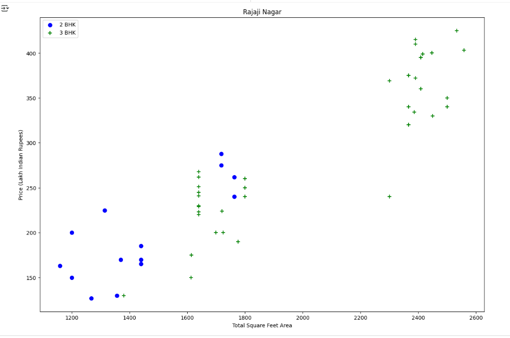
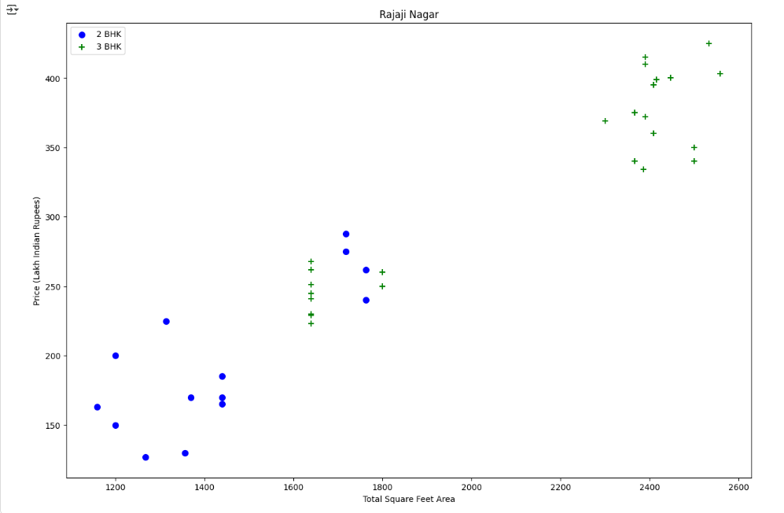

# Proyecto Predicción de precios inmobiliarios (Bangalore)

Modelo de Machine Learning en Python (Jupyter) para estimar precios de viviendas en Bangalore a partir de variables como superficie, ambientes (BHK), baños y ubicación. Incluye limpieza de datos, tratamiento de outliers, codificación de ubicaciones y comparación de modelos.

---

## 🎯 Objetivo

- Preparar y limpiar el dataset Bengaluru_House_Data.csv.

- Normalizar superficies con rangos (ej. “2100–2850”) y crear BHK y precio por m²/pie.

- Reducir outliers por ubicación y por inconsistencias entre categorías de BHK.

- Entrenar y evaluar modelos (Linear Regression, Lasso, Decision Tree) con validación cruzada.

- Exportar el modelo entrenado (.pickle) y el esquema de columnas (columns.json) para predicción.

---

## 🛠️ Desarrollo

1) Carga y depuración

- Dropeo de columnas de baja incidencia: availability, society, balcony, area_type.

- Eliminación de nulos y normalización de strings (trim en location).

- Extracción de BHK desde size (ej. “3 BHK” → bhk = 3).

- Conversión de total_sqft:

Si viene en rango (ej. 2100-2850) se toma el promedio.

Si no es convertible a número, se marca como None y se filtra.

- Creación de price_per_sqft = price * 100000 / total_sqft.

2) Ubicaciones y rareza

- Conteo por location, las ubicaciones con ≤10 registros se agrupan como other.

3) Reglas de outliers

- Regla de densidad mínima: eliminar propiedades con total_sqft / bhk < 300.

- Outliers por ubicación (función remove_pps_outliers):

Por cada location, se queda con precios por m² dentro de [μ − σ, μ + σ].

- Outliers por BHK (función remove_bhk_outliers):

En una misma ubicación, si la categoría BHK n tiene price_per_sqft < media de BHK (n−1) (con suficiente soporte), se excluye.

Previo proceso

Post proceso

4) Modelado y evaluación

- Split 80/20 con train_test_split.

- Modelos:

Linear Regression

Lasso Regression

Decision Tree Regressor

- Validación cruzada con ShuffleSplit y búsqueda de hiperparámetros con GridSearchCV.

- Métrica principal: R².

5) Exportación y predicción

- Se guarda el modelo final con pickle.

- Se exporta el orden de columnas para inferencia con columns.json.

- Función de predicción lista para usar: predict_price(location, total_sqft, bath, bhk).

---

## 📸 Ejemplos (código del notebook)

Selección de modelo con GridSearchCV (Linear Regression, Lasso, Decision Tree), destacando Linear Regression como el más performante 

---

## 📊 Resultados

- Dataset depurado con reducción de ruido y outliers (mejora la estabilidad del modelo).

- R² (test) y mean CV score (completar con tus números al ejecutar el notebook).

- predict_price() operativo para estimar precios por ubicación, superficie, baños y BHK.

- Artefactos listos para despliegue: banglore_home_prices_model.pickle + columns.json.

---

## 🔧 Tecnologías utilizadas

- Python (Pandas, NumPy)

- Matplotlib (visualización)

- Scikit-learn (Linear Regression, Lasso, Decision Tree, ShuffleSplit, GridSearchCV)

- Pickle / JSON (artefactos para inferencia)

- Jupyter Notebook
